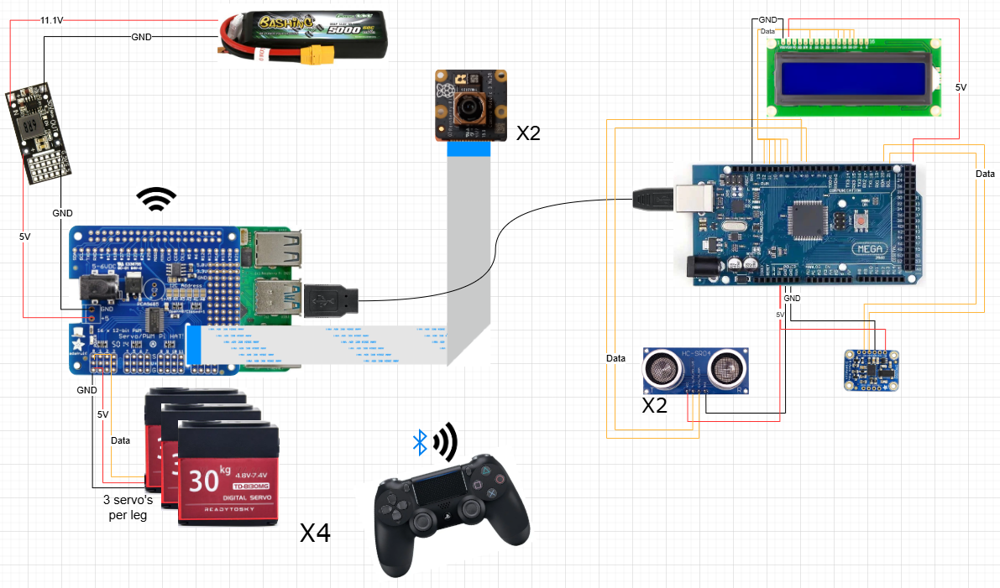

# Sycamore

A python framework for Quad-EX.

### Contribution Guidelines

Branch names should state your name and purpose: e.g. joost/walking-engine

All files are formatted with the ruff formatter. Usage: ruff format

Make a branch, don't commit directly to main. If you want to, fork the repo.

### Setup

Create a venv, and install the dependencies as specified in `requirements.txt`:

```sh
python -m venv .venv
source .venv/bin/activate
pip install -r requirements.txt
```

### Setting Up Permissions

Run the following script to set up the necessary permissions for accessing input devices (controller):

```bash
./setup.sh
```

### Linux Service

There is a linux service that runs on startup, it is necessary to display the raspberry pi ip on the lcd, it executes: "python main.py --motors", so it does not turn on motors. The contents of the linux service file can be found in the sycamore.service file in the linux folder. The actual file is present on the raspberry pi under:

```
/etc/systemd/system/sycamore.service
```

some commands for usage:

```
sudo systemctl daemon-reload
sudo systemctl restart sycamore.service
sudo systemctl status sycamore.service

# Uses killsignal SIGINT which works like a keyboard interrupt
sudo systemctl stop sycamore.service
```

If the program fails (for example the ip doesn’t show up) the error gets redirected and can be seen with the command:

```
journalctl -u sycamore.service -f
```

### Arduino

The files for arduino can be found under the arduino map. The file "main.ino" is currently on the arduino and handles showing the ip and streaming data from the ultrasonic distance sensors from the arduino to the raspberry pi.

There is also an "imu.ino" file which was used to test the imu but is not integrated yet. It is up to future collaborators to properly integrate the imu. Note that the imu is currently also not properly placed within Quad-EX, this should also be done for it to work as intended.

For further information about the IMU, see [https://learn.adafruit.com/adafruit-bno055-absolute-orientation-sensor/arduino-code]().

### Argparse

Argparse is an argument parser for python and is used within sycamore to enable or disable certain features on execution. Note that the values are boolean and that the action thus determines the default and what it does. For example:

```
parser.add_argument(
        "--arduino",
        action="store_false",
    )
```

store_false means that the default is True and that you can disable arduino by adding a --arduino flag. Please DO NOT do --arduino False, this is not necessary and will not work.

### Walking Engine

The walking engine is based on various papers, codebases and our own tinkering. Some useful links are:

[https://www.researchgate.net/publication/332374021_Leg_Trajectory_Planning_for_Quadruped_Robots_with_High-Speed_Trot_Gait]()

[https://spotmicroai.readthedocs.io/en/latest/kinematic/#setup-our-3d-ouput]()

[https://www.researchgate.net/publication/322594373_Inverse_Kinematic_Analysis_of_a_Quadruped_Robot]()

[https://github.com/miguelasd688/4-legged-robot-model]()

For documentation about how the walking engine works please contact Makerspace staff and ask for the final report from Quad-EX.

Some important notes are:

The coordinate frame for the foot matrix is:

```
        """
        -x
            |
            |
            |    /  z
            |   /
            |  /
            | /
            |/____________  -y
        """
```

The inverse kinematics, providing the joint angles for the servo's, are calculated in ik.py. These joint angles are then given by providing the LegPoints matrix, containing the end effectors of all four feet, into the JointAngleProvider. The joint angle provider will then provide the angles which can be passed on into the ServoFactory class which will move the actuators. Note that the actuators have a calibration that makes them work, this is why there are servo_flip and servo_map methods in ServoFactory.

### Manual Servo Calibration

The servo's are manually calibrated. This is based on how the legs should move. This entire process is done manually and we never made a consice calibration method. This, again, is something a new contributor might work on. The test_servos.py file is available for some testing when you're calibrating.

### Visualizations

In order to visualize the robot we use rerun. It is a state of the art robotics visualization program and we highly recommend looking it up and reading through the documentation before use. When you want to visualize something you should add the ipv4 from your laptop into rr.connect_tcp("[your laptop ip]:9876"). Note that you should have a rerun window open when you run this, it won't open a window by itself. There is a visualization.py file, most of it is outdated but we kept it in since it might give new contributors some idea of how to visualize something.

### Controller

The controller is something we worked on but it is not properly integrated into the framework, see margriet/controller-input. We recommend going for the evdev approach over the pygame approach for lower overhead and utilizing the controller for simple things should not require much effort besides what we have already implemented.

### Sensors

The sensors that we properly wrote code for are the distance sensors and the lcd. There are also two camera's. We have conducted tests with camera's in an isolated environment but they are not integrated into the framework yet. It might be worthwhile for a new contributor to work on this.

### Mechanical

See [here](build_instructions/README.md).

### Electronics


