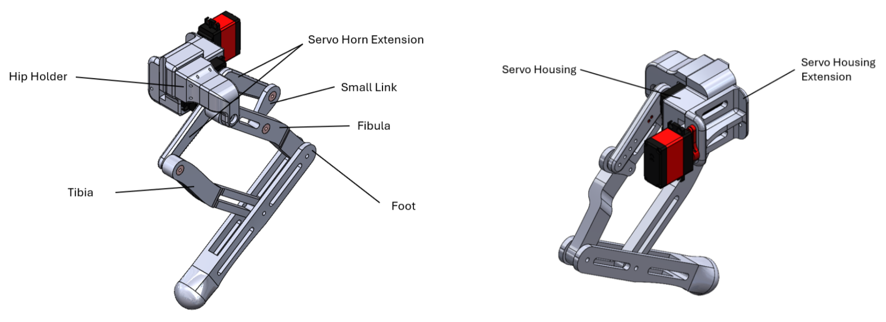
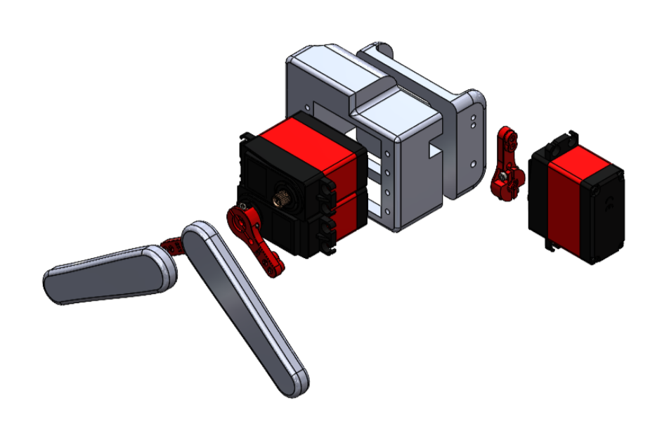
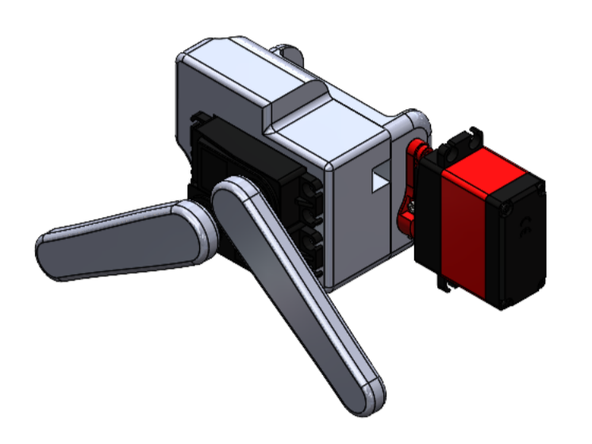
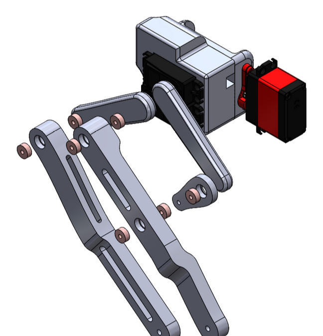
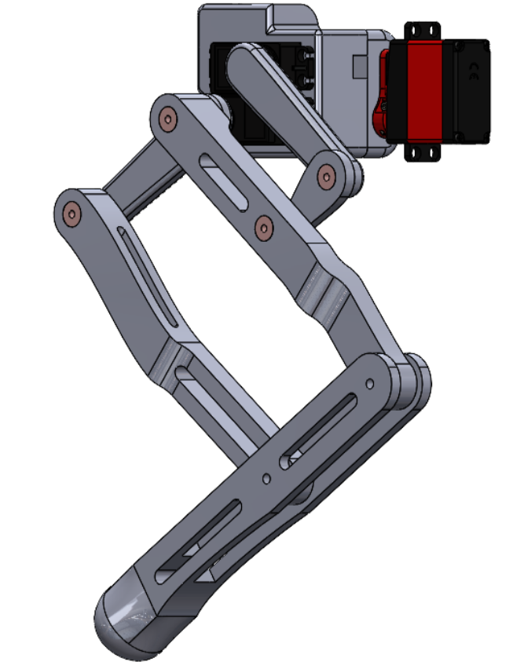
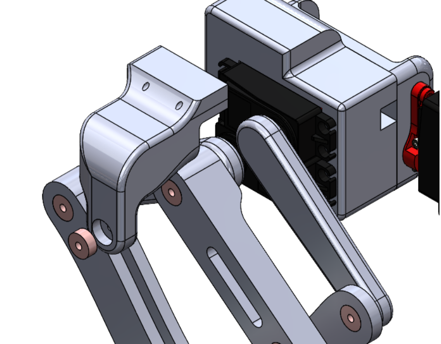
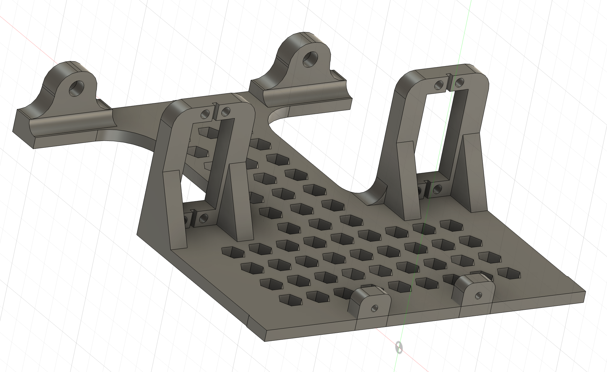

# Build Instructions For Quad-EX

### Leg Assembly

Below you can find a general assembly of the leg, with each part labelled exactly as the STL file. (this particular assembly is the top left leg).

The first step is to assemble the servos with their servo horns and associated servo extension. The exploded view below shows this visually.

**Important:** The servo horn must be tightened on the servo using the small screws it comes with. Otherwise, the horn doesn’t stay on.

**Important:** The servo housing barely fits the servos (design mistake). This means you will have to push the servos in quite hard, and that the cables won’t go through. Therefore, you will have to unscrew the servo from the back to move the cable out of the way, place it in the housing and then screw it back on once it is fitted in. The advantage is that you won’t have to make use of the holes that are on the servo housing; the servos stay attached.

**Important:** To connect the servo housing extension to the servo housing, you will have to use screws. This is an annoying procedure, and an obvious design flaw. I recommend using only two screws placed diagonally away from each other. Tip: Make a small hole using a drill, then use a screwdriver to fit in the screw. You can also use hot glue to temporarily secure the servo housing extension, so it doesn’t move around when you use the screw driver. A clamping mechanism can also work.

**Important:** The servo horn extension needs to be securely attached to the servo horn. I recommend using a short bolt. For the servo that has the hip holder, do not use a bolt now, since you will block the way. Instead, bolt it in the next available hole. For the other servo, it doesn’t matter.

At this stage, the assembly should look like this:

The next step is to add all the bearings into the tibia, fibula and small link. The bearings needed are sized 10 mm x 3 mm with 4 mm thickness. The link to the exact bearing used for this project is found here: [https://www.123-3d.nl/123-3D-Kogellager-623ZZ-1-stuk-i18-t13131.html](https://www.123-3d.nl/123-3D-Kogellager-623ZZ-1-stuk-i18-t13131.html).

Once the bearings are pressed into the design (you may need to use a hammer), you can begin to assemble them into the leg. To join all the parts together, you will have to use M3 bolts as the axles for the bearings. The exact length of the bolt use doesn’t matter, but try to give enough room for at least 2 nuts to be used to tighten the parts together. Below is an exploded view of how to assemble it all:

Important: when assembling the bearings, its ok to use a hammer as long as you use some protective layer in between (a piece of cloth). Not doing this will likely damage the bearing.

Important: Don’t tightening the bolts on the bearings too hard, it will “pinch” the bearings which won’t make them work.

Important: Use washers in plastic-plastic interfaces. Not only is this important to reduce friction, but also is important when assembling the foot.

Important: Do not yet use a bolt on the hip joint, since the hip holder still has to be attached.

Tip: I recommend using nyloc nuts as they prevent loosening due to vibrations. It makes a really big difference. If you don’t, I suggest using two nuts after each other.

Once this is all assembled, you can begin assembling the foot. This is relatively simple, just use bolts, nuts and washers. The below figure shows the stage you should be at now.

You can now add the hip holder to the leg assembly. You will need one bearing, and a rather long, 40mm M3 bolt to hold all the parts attached to the hip.

**Important:** To attach the hip holder on the servo housing, screws were used. This turned out rather bad for us, so I recommend using PLA glue instead.

The leg is now assembled.

### Body Assembly

This is half of the robot's body, 3D printed as part of a two-piece assembly. Two parts can be connected using screws and nuts through the smaller supports at the ends. These smaller supports provide a secure fit for the assembly. Inside the larger supports, each is fitted with a bearing, allowing a screw to pass through the bearing and secure the leg to the body. The hip servo motor is housed in the support with a rectangular opening. Once in place, the servo motor can be attached to the leg as described in the leg assembly section above, ensuring a smooth and stable connection for the robot's movement.
